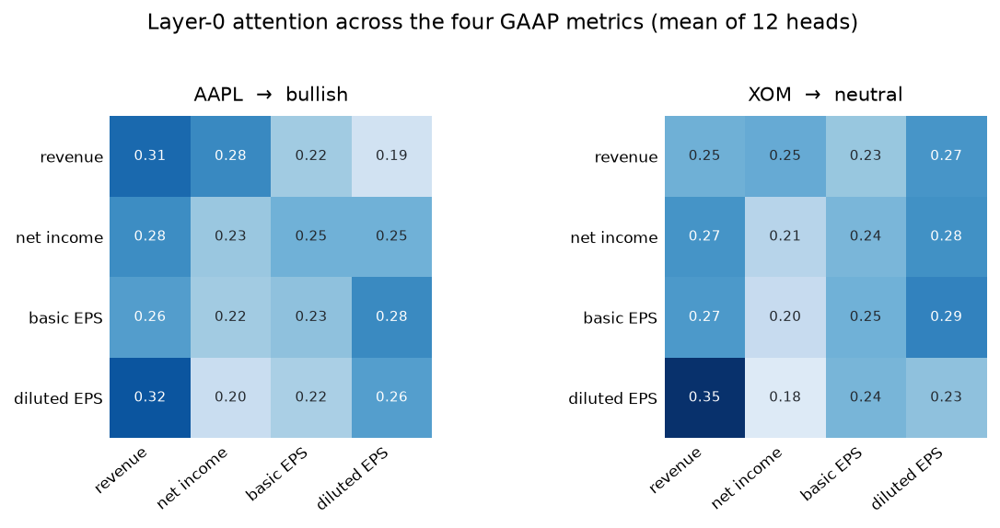

<div align="center">

# Earnings Press Report Predictive Transformer

**An attention-based transformer encoder that forecasts post-earnings stock movement
from the four GAAP figures in every earnings release.**

[](https://www.python.org)
[](https://pytorch.org)
[](#live-demo)
[](LICENSE)

</div>

---

## Goal of this project

- Adapt the encoder from ***Attention Is All You Need*** (Vaswani et al., 2017) to a
  financial forecasting task instead of machine translation
- Pull real earnings data straight from the **SEC EDGAR** API — no vendor feeds
- Represent four financial metrics as a **4 × 768** matrix and run multi-head
  self-attention over them
- Train end to end with **Adam** and backpropagation to classify the next session's move
  as **bullish / bearish / neutral**
- Ship it as a public, interactive web app

```
data  ->  embedding  ->  encoder × 6  ->  prediction  ->  deployment
```

## Live demo

**https://huggingface.co/spaces/Racecarman0924/earnings-press-report-predictive-transformer** *(pending deploy)*

Enter any ticker. The app fetches that company's latest GAAP figures live from SEC EDGAR,
runs them through the encoder, and shows the prediction alongside the attention matrix.

## Run on local

```bash
streamlit run app.py
```

## Steps

1. Create a virtual environment and install the dependencies.
2. Build the dataset by running `python data/fetch.py`.
3. Verify the architecture by running `python model/encoder.py`.
4. Train the model by running `python train.py`.
5. Launch the app with `streamlit run app.py`.

---

# Step 1. Project setup

Create the environment and install dependencies:

```bash
python -m venv .venv
.venv/bin/pip install -r requirements.txt
```

| dependency | used for |
|---|---|
| `torch` | the encoder, autograd, Adam |
| `sentence-transformers` | the 768-dimensional financial text embedder |
| `streamlit` | the web app |
| `requests` | SEC EDGAR API |
| `yfinance` | prices, for building the labels |

# Step 2. Data pipeline

`data/fetch.py` builds the dataset from primary sources only.

1. **Universe** — the S&P 500 constituent list, mapped to CIK numbers via SEC's
   `company_tickers.json`.
2. **The four figures** — SEC's XBRL `frames` API returns every filer's value for one
   concept in a single request, so the four GAAP metrics cost four requests rather than
   two thousand:

   | field | XBRL tag |
   |---|---|
   | total revenue | `RevenueFromContractWithCustomerExcludingAssessedTax`, falling back to `Revenues` |
   | net income | `NetIncomeLoss` |
   | basic EPS | `EarningsPerShareBasic` |
   | diluted EPS | `EarningsPerShareDiluted` |

3. **Release timing** — each 8-K carrying Item 2.02 has an `acceptanceDateTime`. Releases
   before 09:30 ET are measured on the same session, those at or after 16:00 on the next,
   and intraday releases are skipped.
4. **Label** — the raw open→close return of that session, bucketed at the **training
   split's terciles**.

```bash
python data/fetch.py
```

```
[1/5] universe
  503 S&P 500 tickers, 503 mapped to a CIK
[2/5] XBRL frames for CY2026Q2
[3/5] 8-K Item 2.02 filings 2026-07-01..2026-08-15
  323 prints with all four GAAP figures and a usable session
[5/5] 323 labelled samples

  drop reasons:
    missing_gaap_figure          109
    no_8k_2.02_in_window          59
    mid_session                   12
```

Splits are **time-ordered, never random** — the whole market moves together on a given
day, so a random split would leak same-day information across train and test.

# Step 3. Input representation

Each metric becomes one row of the 4 × 768 input matrix, built from two channels.

**The text channel** carries *which* metric a row is. A fixed template — identical across
every company — is embedded by a financial sentence encoder:

```
"GAAP total revenue was 109,417.0 million dollars"   ->   1 × 768
```

**The numeric channel** carries *how large* the number is, because the text channel
cannot. Embedding a ladder of revenues from \$1M to \$100B produces a maximum cosine
distance of only **0.0031**, and not even monotonically — the sentence differs in one
token out of eight, and mean-pooling averages that difference into noise:

```bash
python model/embed.py
```

So each metric also gets its own learned projection of its scalar:

$$\text{numeric}_j = s_j \cdot W_j + b_j, \qquad W_j, b_j \in \mathbb{R}^{768}$$

summed into the text embedding, exactly as the 2017 paper sums positional encodings into
token embeddings. Mean pairwise distance between input matrices rises **0.0043 → 0.3602**,
a factor of **83**.

**The √d_model scaling.** The sum is multiplied by $\sqrt{768} = 27.71$, per §3.4 of the
paper. Without it, layer 0 receives rows of norm 1.32 while LayerNorm feeds every later
layer rows of norm $\sqrt{768}$ — and since attention scores are $QK^\top/\sqrt{d_k}$,
small rows mean near-zero logits and a softmax pinned at uniform:

| layer | row norm in | attention deviation from uniform |
|---:|---:|---:|
| 0 *(unscaled)* | 1.32 | 0.0043 |
| 1 | 27.71 | 0.1548 |
| 2 | 27.71 | 0.1908 |
| 3 | 27.72 | 0.3306 |
| 4 | 27.71 | 0.2973 |
| 5 | 27.71 | 0.1707 |

With the scaling applied, layer 0 sits in the same range as the rest.

# Step 4. The encoder

Encoder only — no decoder. The task is classification over a fixed 4-metric input, not
sequence transduction.

```
                       4 × 768 input matrix
                                │
        ┌───────────────── encoder layer ─────────────────┐
        │   multi-head self-attention — 12 heads, d_k=64  │
        │   add & norm                                    │   × 6
        │   feed-forward  768 → 3072 → 768  (ReLU)        │
        │   add & norm                                    │
        └─────────────────────────────────────────────────┘
                                │
                   mean-pool  →  Linear(768, 3)
                                │
                 bullish   /   bearish   /   neutral
```

| component | value |
|---|---|
| Encoder layers | 6, independently initialised |
| Attention heads | 12, `d_k = d_v = 64` |
| `d_model` / `d_ff` | 768 / 3072, ReLU |
| Normalisation | post-LN — add **then** normalise, ε = 1e-6 |
| Positional encoding | none — metric identity is carried by the embedded text |
| Classification head | mean-pool the 4 rows → `Linear(768, 3)` |
| **Trainable parameters** | **42,535,683** |

Every one of those values is asserted against the spec by a self-test:

```bash
python model/encoder.py
```

```
  shape checks against the flowchart:
    OK   input matrix                           (4, 768) == (4, 768)
    OK   attention weights (per chart: 4 x 4)   (4, 4) == (4, 4)
    OK   W^O projection                         (768, 768) == (768, 768)
    OK   FFN W_1                                (3072, 768) == (3072, 768)
    OK   FFN W_2                                (768, 3072) == (768, 3072)
    OK   output logits                          (3,) == (3,)
    OK   6 independently-init layers            distinct-tensors=True distinct-values=True
    OK   encoder repeats 6 times                6 layers
    OK   numeric channel responds to scalars    delta=0.0862
    OK   per-metric numeric projections         True
    OK   layer-norm eps == 1e-6                 1e-06
    OK   post-LN (add then normalise)           norm_first=False
    OK   12 heads, d_k = 64                     12 heads

  trainable parameters: 42,535,683
  self-test: PASS
```

# Step 5. Training

A forward pass produces three logits; cross-entropy scores them against the move the stock
actually made; `loss.backward()` applies the chain rule back to every weight; Adam updates
each parameter using its two moving averages, with bias correction.

| setting | value |
|---|---|
| Optimiser | Adam, β = (0.9, 0.98), ε = 1e-9 |
| Learning rate | peak 3e-5, warmup then inverse-sqrt decay (§5.3) |
| Loss | 3-class cross-entropy |
| Regularisation | dropout 0.1, gradient clipping at 1.0 |
| Epochs | 25, fixed — no validation-based checkpoint selection |
| Embedder | frozen |

```bash
python train.py
```

Training logs the attention deviation and per-layer gradient norms every epoch, so you can
watch attention move away from uniform as the heads specialise.

# Step 6. Inference

```bash
python predict.py --ticker AAPL NVDA --attention
```

```
── AAPL  (CIK 320193)
     GAAP total revenue          109,417.0 M
     GAAP net income              29,789.0 M
     GAAP basic EPS                     2.03
     GAAP diluted EPS                   2.02
     ->  PREDICTION                  BULLISH
```



Uniform 0.250 everywhere would mean attention is doing nothing and the model is simply
averaging the four metrics. The spread above is learned.

# Step 7. Deployment

The app is a Streamlit front end over the same pipeline: it fetches a company's latest
GAAP figures live from SEC EDGAR, falls back to the bundled dataset if the API is
unavailable, and renders the prediction with its attention matrix.

```bash
streamlit run app.py
```

`export_deploy.py` casts the checkpoint to fp16 for deployment, taking it from 170 MB to
85 MB.

---

## Project layout

```
├── app.py                  Streamlit app — live EDGAR fetch, cached fallback
├── train.py                Training loop with attention/gradient instrumentation
├── predict.py              Command-line demo
├── export_deploy.py        fp16 checkpoint export
├── notebook.ipynb          End-to-end walkthrough
├── model/
│   ├── encoder.py          The encoder + 13-check self-test
│   └── embed.py            Text templates, numeric channel, magnitude probe
├── data/
│   └── fetch.py            SEC EDGAR → XBRL → prices pipeline
└── docs/
```

## Scope

The model reads **absolute** GAAP levels with no expectation anchor — no consensus
estimate, no prior quarter — and is trained on a single earnings season. It demonstrates
the architecture and the data pipeline end to end.

## References

- Vaswani et al. (2017), [*Attention Is All You Need*](https://arxiv.org/abs/1706.03762)
- [SEC EDGAR APIs](https://www.sec.gov/search-filings/edgar-application-programming-interfaces)

## License

[MIT](LICENSE)
